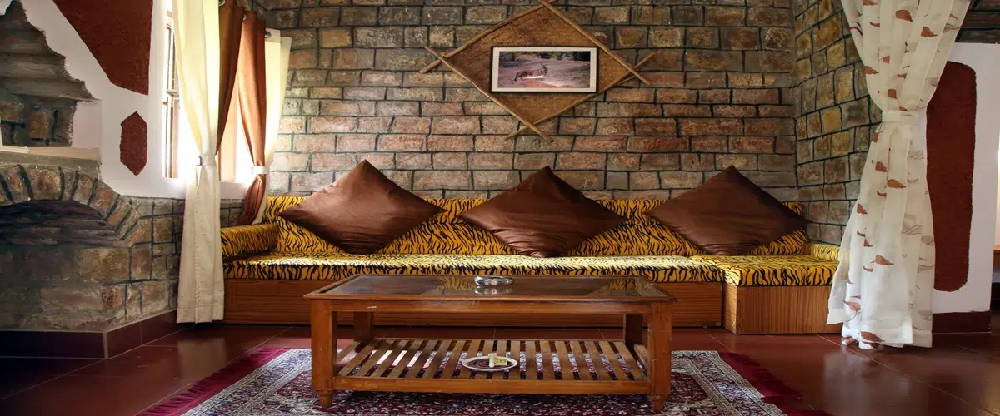
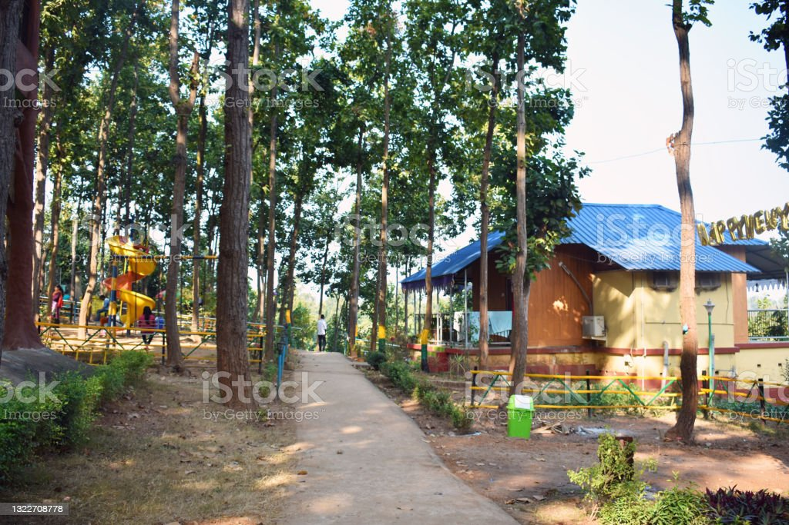

<html lang="en"><head>
    <meta charset="utf-8">
    <meta name="viewport" content="width=device-width, initial-scale=1">
    <title>Baghel Group</title>
    <link href="https://cdn.jsdelivr.net/npm/bootstrap@5.3.0/dist/css/bootstrap.min.css" rel="stylesheet" integrity="sha384-9ndCyUaIbzAi2FUVXJi0CjmCapSmO7SnpJef0486qhLnuZ2cdeRhO02iuK6FUUVM" crossorigin="anonymous">
  </head>

  <body>
        
          <!-- Navbar -->

          <nav class="navbar navbar-expand bg-dark border-bottom border-bottom-dark" data-bs-theme="dark" ba="">
            

                <button type="button" class="btn btn-warning btn-lg">BAGHEL GROUP</button>
              

                <ul class="navbar-nav me-auto mb-2 mb-lg-0">
                  <li class="nav-item">
                    <a class="nav-link active" aria-current="page" href="#">Home</a>
                  </li>
                  <li class="nav-item">
                    <a class="nav-link" href="#">Gallery</a>
                  </li>
                  <li class="nav-item dropdown">
                    <a class="nav-link dropdown-toggle" href="#" role="button" data-bs-toggle="dropdown" aria-expanded="false">
                     Facilities
                    </a>
                    <ul class="dropdown-menu">
                      <li><a class="dropdown-item" href="#">Water Parks</a></li>
                      <li><a class="dropdown-item" href="#">Jungle Safari</a></li>
                      <li>
</li>
                      <li><a class="dropdown-item" href="#">WEDDINGS</a></li>
                    </ul>
                  </li>
                  <li class="nav-item">
                    <a class="nav-link" href="#">About US</a>
                  </li>
                </ul>
                <button type="button" class="btn btn-primary btn-lg">BOOK NOW</button>

              

            

          </nav>

           <!-- Carsouel -->

           

            <h1 class="h-1">
              Welcome To The Baghel Group
            </h1>
            

              

                
              

              

                
              

              

                
              

            

            <button class="carousel-control-prev" type="button" data-bs-target="#carouselExample" data-bs-slide="prev">
              
              Previous
            </button>
            <button class="carousel-control-next" type="button" data-bs-target="#carouselExample" data-bs-slide="next">
              
              Next
            </button>
          

          

            
         
            

              
 
<h2> Welcome to our Resorts</h2> 
                

                <h5>Baghel Groups -The Jungle Experience, 
is well established. and reputed hospitality brand in jungles of central India.

Both our properties and are beautifully laid out over vast area of forest. We deliver the wilderness experience, which is second to none. Our team of experienced, and trained local staff are known for their hospitality. Between 1997 and 2021, we have been awarded for our excellence by various partners.

You are invited to experience our hospitality, services and more.
</h5>
                
              
            

          

    

      <h1 class="display-4 fw-bold lh-1 text-body-emphasis">Best Experience YOU Ever Had</h1> 
      
Giant saal trees, mist over meadows,foliage, peacock displaying their feathers, chirping of birds, rutting call of sambhar, langurs jumping, Indian roller and drongo doing aerial stunts, Guide and drivers discussing about the movement and suddenly langurs and cheetal starts calling for the king's arrival. and a then, a loud growl of the king, Tiger and the entire jungle becomes alive. A lot more happens in safari. Book a safari now with us.

      
    

    

        
    

  

      

      <main>
        

          <header class="pb-3 mb-4 border-bottom">
            <a href="/" class="d-flex align-items-center text-body-emphasis text-decoration-none">
              <svg xmlns="http://www.w3.org/2000/svg" width="40" height="32" class="me-2" viewBox="0 0 118 94" role="img"><title>Bootstrap</title><path fill-rule="evenodd" clip-rule="evenodd" d="M24.509 0c-6.733 0-11.715 5.893-11.492 12.284.214 6.14-.064 14.092-2.066 20.577C8.943 39.365 5.547 43.485 0 44.014v5.972c5.547.529 8.943 4.649 10.951 11.153 2.002 6.485 2.28 14.437 2.066 20.577C12.794 88.106 17.776 94 24.51 94H93.5c6.733 0 11.714-5.893 11.491-12.284-.214-6.14.064-14.092 2.066-20.577 2.009-6.504 5.396-10.624 10.943-11.153v-5.972c-5.547-.529-8.934-4.649-10.943-11.153-2.002-6.484-2.28-14.437-2.066-20.577C105.214 5.894 100.233 0 93.5 0H24.508zM80 57.863C80 66.663 73.436 72 62.543 72H44a2 2 0 01-2-2V24a2 2 0 012-2h18.437c9.083 0 15.044 4.92 15.044 12.474 0 5.302-4.01 10.049-9.119 10.88v.277C75.317 46.394 80 51.21 80 57.863zM60.521 28.34H49.948v14.934h8.905c6.884 0 10.68-2.772 10.68-7.727 0-4.643-3.264-7.207-9.012-7.207zM49.948 49.2v16.458H60.91c7.167 0 10.964-2.876 10.964-8.281 0-5.406-3.903-8.178-11.425-8.178H49.948z" fill="currentColor"></path></svg>
               The BAGHEL GROUP
            </a>
          </header>
      
          

            

              <h1 class="display-5 fw-bold">Jungle Safari</h1>
              

              
Become ready to experince one of the best Jungle Rides with The Baghel Group.

              <button class="btn btn-primary btn-lg" type="button">Book A Ride</button>
            

          

      
          

            

              

                <h2>Destination Weddings</h2>
                

                
Book our Resort to experience your best Moments in their greatest.

                <button class="btn btn-outline-light" type="button">Click Here for INFO</button>
              

            

            

              

                <h2>Tree Houses</h2>
                

                
Have A Night Party,Clubbing and Fun At Its extreme Limits WITH THE BAGHEL GROUP.

                <button class="btn btn-outline-secondary" type="button">Click Here for INFO</button>
              

            

          

        

          <footer class="pt-3 mt-4 text-body-secondary border-top">
            © 2023
            <h1 class="display-5 fw-bold text-body-primary lh-1 mb-3">
              OUR FOUNDER
            </h1>
            

            <h4>
              SHRI ANAND SINGH
            </h4>
            

            

              

                
              

              

               
                
Dear Tourists, 

                  This isn’t business as usual, and it’s a time of great stress and uncertainty. It’s also a moment in time when the work we’re doing is its most critical.  
                  
                  We’ve changed our logistics, transportation, supply chain, purchasing, and third party seller processes to prioritize stocking and delivering essential items like household staples, sanitizers, baby formula, and medical supplies. We’re providing a vital service to people everywhere, especially to those, like the elderly, who are most vulnerable. People are depending on us.

                
              

            

          </footer>
        
      </main>
      
       

    
  
</body></html>
